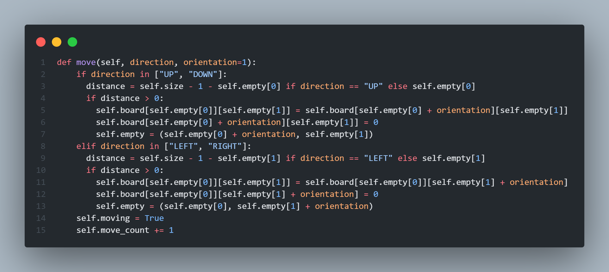
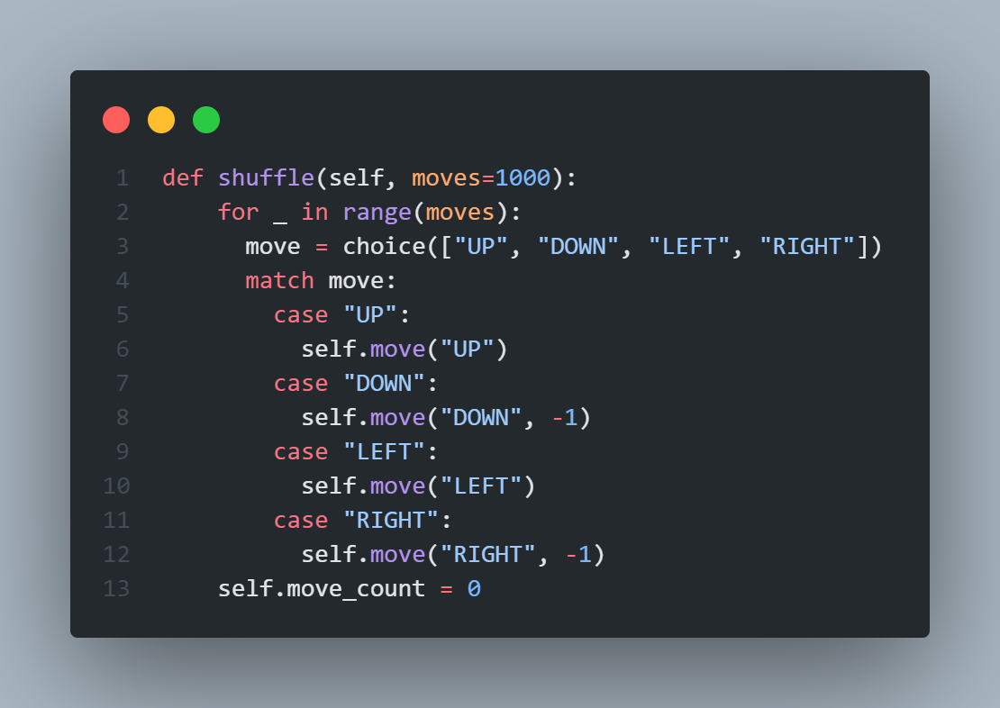
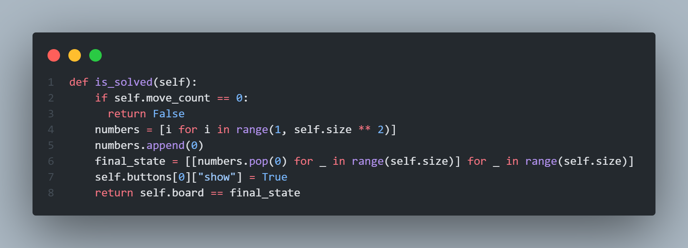
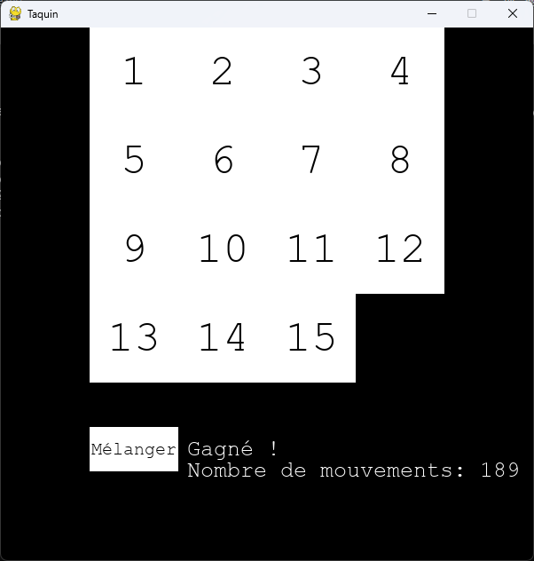

**Titre du projet**: Jeu du taquin

**Description du projet**: Jeu du taquin utilisant la librairie graphique `pygame` en python

**Objectifs du projet**: Créer un jeu du taquin avec une interface graphique

**Etapes du projet**:
- Création du jeu du taquin avec une interface graphique
- Implémentation des mouvements du taquin
- Fonction de mélange du taquin
- Détection de si le taquin est résolu
- Affichage d'un message de victoire avec le nombre de mouvements effectués

**Réalisations**:
- Création du jeu du taquin avec une interface graphique

- Implémentation des mouvements du taquin

- Fonction de mélange du taquin

- Détection de si le taquin est résolu

- Affichage d'un message de victoire avec le nombre de mouvements effectués
